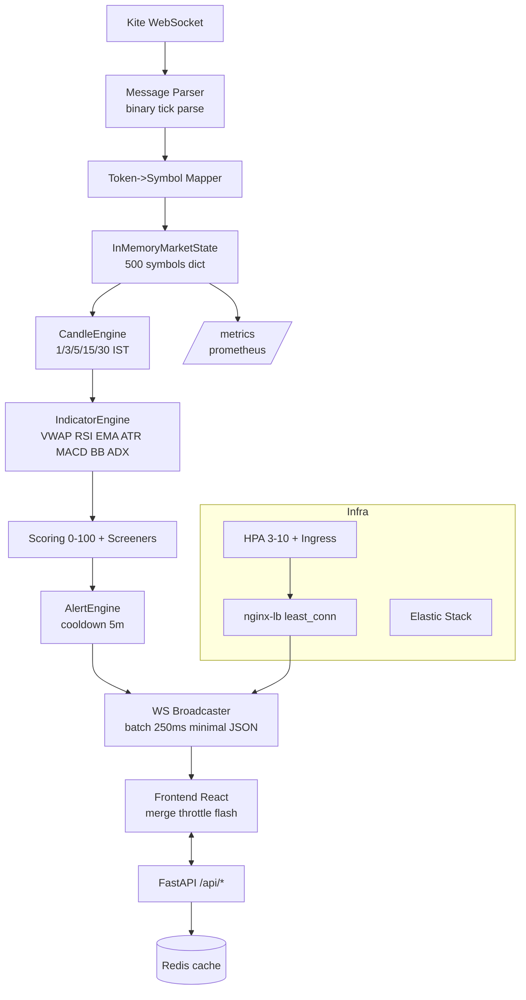

# Architecture

## Diagram



## Data Flow

1. **WebSocket Feed** (Kite/Mock/Replay) -> binary frames
2. **Message Parser** validates, extracts LTP/volume/OHLC
3. **Mapper** token->symbol via universe JSON
4. **MarketState** updates tick, freshness, gaps
5. **CandleEngine** aggregates IST boundaries (floor to interval)
6. **IndicatorEngine** incremental VWAP/RSI (guard <14 candles)
7. **Signal/Score** weighted 25/25/20/15/10/5
8. **Broadcaster** fan-out single upstream to N clients
9. **Frontend** merges delta, throttles render, flashes changed rows

## Component Table

| Layer | Tech | Scale | Notes |
|-------|------|-------|-------|
| Backend | FastAPI+uvicorn | HPA 3-10 | async, startup probe |
| WS | websocket-client | 1 upstream | resubscribe batches 200 |
| Cache | Redis | 1 | screener TTL 5s |
| Frontend | Vite+React | 2 replicas | static via nginx |
| LB | nginx least_conn | - | keepalive 64, 86400 ws timeout |
| Observability | prometheus+grafana+ELK | - | p95 tick latency dashboard |
```
